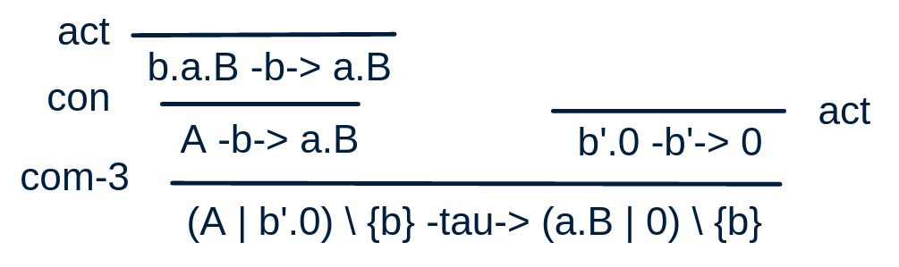
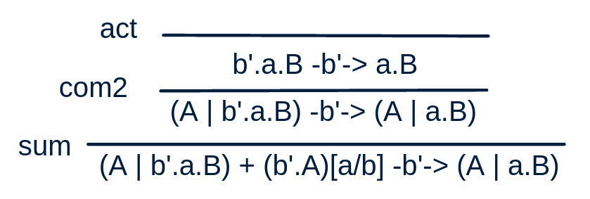
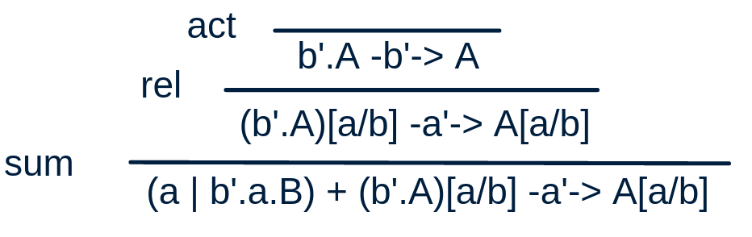

# Exercise 1
$CM \stackrel{def}{=} coin.(steal.CM + \overline{coffee}.CM) \mid malfunction.0$

# Exercise 2
- [x] $a.b.A + B$
- [x] $(a.0 + \overline{a}.A) \setminus \{a,\tau\}$
- [x] $(a.0 \mid \overline{a}.A) \setminus \{a,\tau\}$
- [ ] $a.B + [a/b]$
- [x] $\tau.\tau.B + 0$
- [x] $(a.B + b.B)[a/b,b/a]$
- [ ] $(a.B + \tau.B)[a/\tau, b/a]$, no $f(\tau) = \tau$
- [ ] $(a.B + \tau.B)[\tau/a]$, maybe is $f(a) = \tau$ allowed
- [x] $(a.b.A + \overline{a}.0) \mid B$
- [x] $(a.b.A + \overline{a}.0).B$
- [x] $(a.b.A + \overline{a}.0) + B$
- [x] $(0 \mid 0) + 0$

# Exercise 3

# Exercise 4

